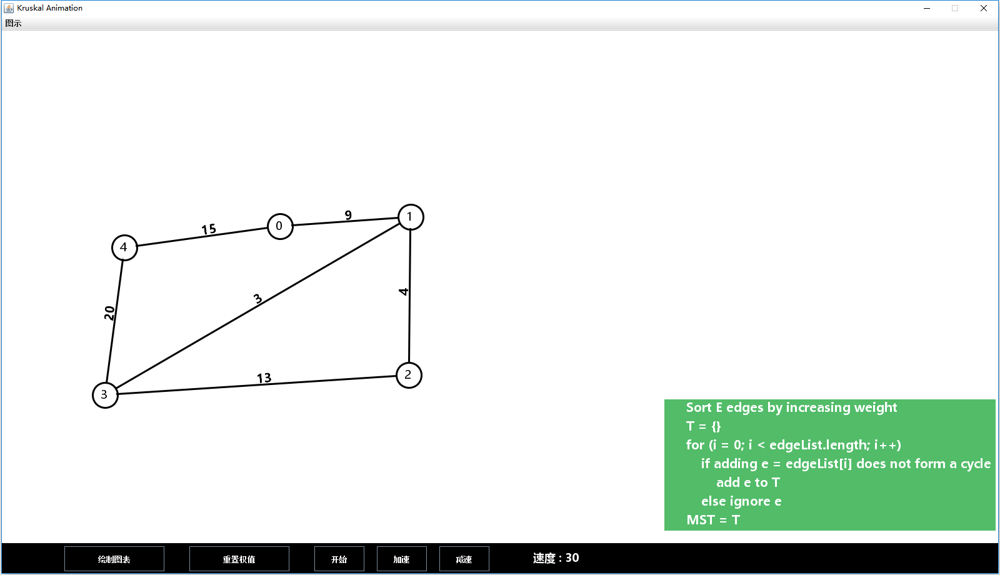
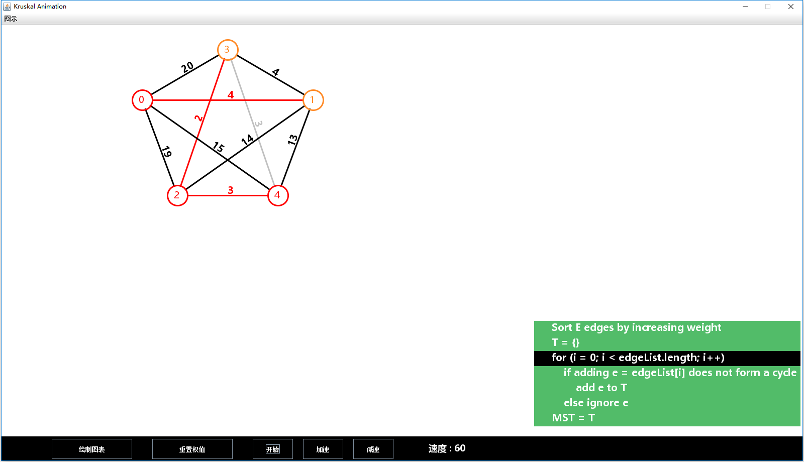

# animated-kruskal

山东大学软件工程专业数据结构课设 —— Kruskal 算法的动态演示。

## 课设要求：

### 最小生成树—Kruskal算法

设计实现无向网结构，针对随机无向网实例和随机起点，用 Kruskal 算法的基本思想求解出所有的最小生成树，并给出求解过程的动态图形演示。

 可考虑实现不同存储结构上的实现。

## 说明：

这次的课设完全是用 Java 原生的 GUI 库实现的，所以界面略显粗糙，代码略显冗杂，后面会考虑学习一下 JavaScript 完成一个网页版的演示，课设的图形界面主要是参考了 [VisuAlgo](https://visualgo.net) 上 最小生成树的界面。

## 协助：

因为个人总不能让每一行代码都 bug free，所以欢迎各位的协助。

纠正、建议、讨论等等欢迎大家通过Issue、PR形式提出！

- 提交 PR：先 Fork 本项目后在个人仓库中做出修改，发起 pull request 即可。
- Issue：添加附件在 Issue 中，由维护者添加。

还请大家注意一下目录结构~代码和说明添加到相应文件夹中。

大于50M资料请压缩成 zip/rar 格式上传。

## 最终效果：

### 用户自定义界面：

### 准备对自定义图执行算法：

### 自定义图执行算法后：

### 事先定义好的图（k5）：

